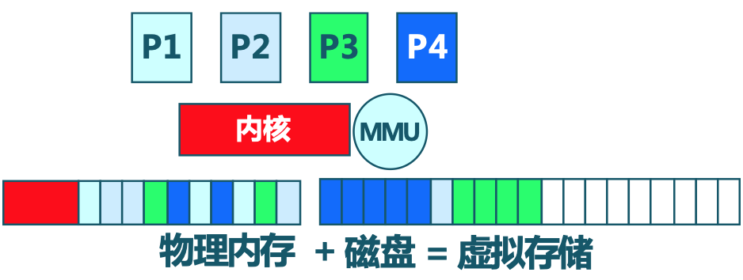
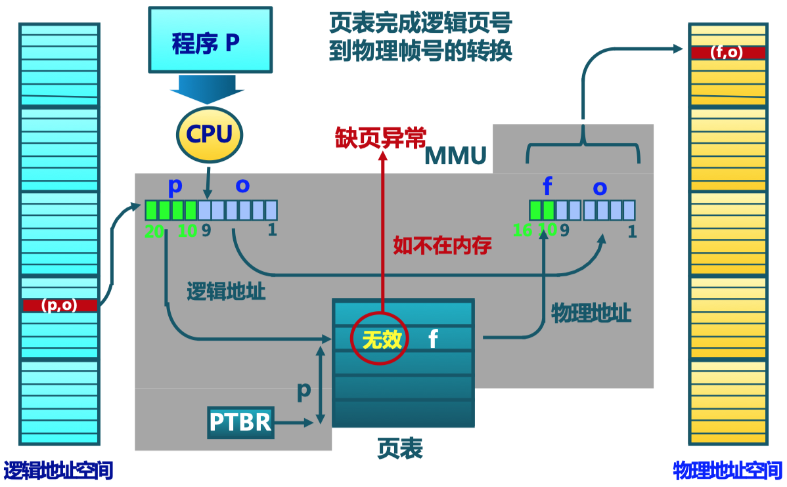

> 重学操作系统系列，清华大学操作系统课程笔记

---



---

在对物理内存的管理中讲到，连续内存分配和非连续内存分配。这两种办法说在物理内存中如何去找到一块可以给进程使用的内存空间。虚拟存储是前面讲的非连续物理内存分配（在内存中找存储空间，可以不连续）的延续。虚拟存储是在非连续内存分配的基础上，同时可以把一部分内容放到外存里的做法，这种做法可以使得应用程序可以有更大的内存空间能够使用。

为啥需要将数据放到外存里去？

## 虚拟存储的需求背景

程序规模的增长速度远远大于存储器容量的增长速度

理想中的存储器要求容量更大、速度更快、价格更便宜，且非易失。但实际中的存储器采用层次结构进行组织

要想增大存储空间的容量，我们就考虑增加最下面成本比较低的（例如磁盘），这样就组成给了一个金字塔的层次结构，让整个系统处于一种均衡的繁忙状态，这就是我们想达到的最终的合理状态了

存储介质多种多样，操作系统对这些存储空间如何管理呢？我们希望操作系统能够对进程地址空间进行规范管理，布局合理。操作系统对存储进行抽象，用户进程使用抽象的地址空间，进程地址空间到存储介质之间的映射关系由操作系统进行维护，这样就提高了程序的通用性，降低了编程的难度

虚拟存储的需求主要原因是计算机系统内存不够用，这是因为多道程序、多进程、多线程这样一些并发性极高的应用程序进行运行所导致的问题。解决办法有以下几种：

- 覆盖（overlay）：应用程序手动把需要的指令和数据保存在内存中
- 对换（swapping）：操作系统自动把暂时不能执行的程序保存到外存中（对换的基本单位是一个进程的整个地址空间，开销比较大，但在早期不支持不连续物理内存分配时使用对换进行程序的交替运行，其开销还是可以接受的）
- 虚拟存储：在有限容量的内存中，以页为单位自动装入更多更大的程序

## 覆盖技术

- 目标：在较小的可用内存中运行较大的程序
- 方法：依据程序逻辑结构，将程序划分为若干个功能相对独立的模块；将不会同时执行的模块的模块共享同一块内存区域。必要部分（常用功能）的代码和数据常驻内存，可选部分（不常用功能）放在其他程序模块中，只在需要用到时装入内存，不存在调用关系的模块可相互覆盖，共用同一块内存区域
- 不足：需程序员划分功能模块，并确定模块间的覆盖关系，增加了编程的复杂度；程序执行时需要从外存装入覆盖模块，覆盖技术是使用执行执行（增大）换取空间（增大）

## 交换技术

- 目标：增加正在运行或需要运行的程序的内存（内存空间大小能够满足一个程序的运行，但由于多道程序执行，在需要执行另一个程序时，内存空间不够，具体图示可参见 物理内存管理-连续内存）
- 方法：将暂时不能运行的程序放到外存。换入换出的基本单位是整个进程的地址空间，换出（swap out）把一个进程的整个地址空间保存到外存，换入（swap in）将外存中某进程的整个地址空间读入到内存

- 面临的问题
  - 交换时机（何时需要发生交换）？只当内存空间不够或有不够的可能时换出
  - 交换区的大小？存放所有用户进程的所有内存映像的拷贝
  - 程序换入时的重定位：换出后再换入时要放在原处吗？采用动态地址映射的方法

## 覆盖与交换的比较

|  比较维度   | 覆盖  |  交换   |
|  :----:  | :----:|  :----:  |
| 基本单位  | 只能发生在没有调用关系的模块间 | 进程的整个地址空间  |
| 各模块关系  | 程序员需要给出模块间的逻辑覆盖关系 | 不需要模块间的逻辑覆盖关系  |
| 发生的粒度  | 发生在运行程序的内部模块间 | 发生在内存进程间  |
| OS 干涉  | 操作系统没法准确掌握逻辑覆盖关系 | 可由操作系统完成  |

那有没有可能综合这两种的优点，能够由操作系统来完成，但不是以整个进程地址空间为单位进行“覆盖”，将正在执行的那一部分放在内存中，另一部分未使用的换到外存中去？这正是虚拟存储完成的事情

## 虚拟存储概念

### 虚拟存储的技术目标

- 1) （将哪些东西放入到内存来？）只把部分程序放到内存中，从而运行比物理内存大的程序
  - 由操作系统自动完成，无需程序员的干涉
- 2) （将哪些东西从内存放出去？）可以把一部分内存空间中的信息放到外存中去，实现进程在内存与外存之间的交换，从而获得更多的空闲内存空间
  - 由操作系统完成，在内存和外存之间只交换进程的部分内容

### 局部性原理（principle of locality）

所谓局部性原理是指程序在执行的过程当中，在一个较短的时间里，其所执行的指令地址和指令的操作数地址，分别局限在一定区域。通常情况下，指令存储在代码段里，指令所访问的操作数存储在数据段里

1. 时间局部性：一条指令的连续两次执行，一个数据的连续两次访问，通常情况下都是集中在一个较短时期内。因此，放置在内存中的这一段内容会频繁被访问到
2. 空间局部性：当前指令和邻近的几条指令，当前访问的数据和邻近的几个数据，访问区域是局限在一个较小的区域里头。
3. 分支局部性：一条跳转指令的两次执行很可能跳到相同的内存位置

有了以上三条局部性原理之后，就能够认为我们所运行的程序，其所执行的指令、所访问的数据具有很好的集中特征，会集中在一个局部的区域里头。这也就是局部性原理的意义，其从理论上说明，虚拟存储技术是能够实现的，而且可取得满意的效果。当然程序的编写会影响局部性（CSAPP 第 5 章 之后可以再看看 TODO）

### 虚拟存储的基本概念

- 思路：将不常用的部分内存块暂存到外存
- 原理：
  - 装载程序时：只将当前指令执行需要的部分页面或段装入内存（当前用不到的还是放在外存里面）
  - 指令执行中需要的指令或数据不在内存（缺页或缺段）时：硬件处理器通知操作系统将相应的页面或段调入内存，重新执行这条指令或访问这个数据
  - 操作系统监控进程地址空间中现在已经在内存中的指令和数据的使用情况，将内存中暂时不用的页面或段保存到外存（操作系统怎么知道哪些是暂时不用的？置换算法）
- 实现方式：虚拟页式存储、虚拟段式存储
- 基本特征：
  - 不连续性：物理内存分配非连续，虚拟地址空间使用非连续
  - 更大的用户空间：提供给用户的虚拟内存可大于实际的物理内存
  - 部分交换：虚拟存储只对部分虚拟地址空间进行换入和换出
- 虚拟存储的支持技术：
  - 硬件支持：页式或短时存储中的地址转换机制（需要知道访问的指令或数据是在内存中还是在外存中？）
  - 操作系统：管理内存和外存间页面或段的换入和换出

## 虚拟页式存储

在页式存储管理的基础上，增加请求调页和页面置换

### 思路

- 1) 在用户程序要装载到内存运行时，只装入部分页面，就启动程序运行（与页式存储管理不一样的地方，页式存储管理加载时会将所有的物理帧都加载到内存当中，只是它实现了存储的不连续，每个页连续）
- 2) 进程在运行中发现有需要的代码或数据不在内存时，则向系统发出缺页异常请求（在页式管理中也会出现异常，但不会出现缺页，因为在页式管理中进程地址空间中的任何一个页面都有对应的一个物理页帧存在）
- 3) 操作系统处理缺页异常，将外存中相应的页面调入内存，使得进程能继续运行

### 虚拟页式存储中的地址转换

该页是否在物理内存里有对应的帧，在页表中有一个标志位，用于标识对应的页是否在物理内存里头。如果当前页不在物理内存（标志位为 0），会产生缺页异常，由操作系统接管。操作系统需要从外存中将页面调入物理内存，返回给 CPU 进行执行，然后在页表中将对应的页表项中的标志位置为 1

在虚拟页式存储中的页表项结构也要做相应的修改，需要用的标志位如下：

1. 驻留位：表示该页是否在内存
    - 1 表示该页位于内存中，该页表项是有效的，可以使用
    - 0 表示该页当前在外存中，访问该页表项将导致缺页异常
2. 修改位：表示在内存中的该页是否被修改过
    - 回收该物理页面时，据此判断是否要把它的内容写回外存
3. 访问位：表示该页面在过去一段时间里面是否被访问过（读或写）
    - 因为在虚拟页式存储管理里面，需要有一个置换算法把不常用的页面置换到外存中去，依靠访问位来进行统计，近似统计该页是否被经常访问
    - 用于页面置换算法
4. 保护位：表示该页的允许访问方式（可读、可写、可执行等）

### 缺页异常

缺页异常就是在页表项中发现这一页不在物理内存中时，就会产生缺页异常，由操作系统接管，操作系统将相应的内容从外存读到内存中来，再重新执行这条指令

缺页异常的处理流程：

1. Load M 查找 M 所对应的页表项，如果页表项中驻留位为 1，则表示在物理内存中有对应的帧，否则就会产生缺页异常；
2. 缺页异常会由操作系统接管
3. 缺页异常服务例程进行处理，找到对应页在外存中的位置
4. 将外存中对应的内容载入物理内存的空闲页帧中（怎么找空闲帧？如果没有空闲帧怎么办？）
5. 修改对应页表项
6. 重新执行导致异常的指令 Load M

对于上述第 4 步，具体怎么找物理内存中的空闲帧呢？

1. 在内存中有空闲物理页帧时，分配一物理页帧 f，转第 v. 步
2. 依据页面置换算法选择将被替换的物理页帧 f，对应逻辑页 q
3. 如 q 被修改过，则把它写回外存
4. 修改 q 的页表项中驻留位为 0
5. 将需要访问的页 p 装入到物理页帧 f
6. 修改 p 的页表项驻留位为 1，物理页帧号为 f
7. 重新执行产生缺页异常的指令

### 虚拟页式存储中的外存管理

- 在何处保存未被映射的页？
  - 应能方便地找到在外存中的页面内容
  - 交换空间（磁盘或文件）：采用特殊格式存储未被映射的页面
- 虚拟页式存储中的外存选择
  - 代码段：可执行二进制文件
  - 动态加载的共享库程序段：动态调用的库文件
  - 其他段：交换空间

### 虚拟页式存储管理的性能

有效存储访问时间（effective memory access time，EAT）= 访存时间 * (1 - p) + 缺页异常处理时间 * 缺页率 p

## 版权声明

本作品采用[知识共享署名 4.0 国际许可协议](http://creativecommons.org/licenses/by/4.0/)进行许可，转载时请注明原文链接。
