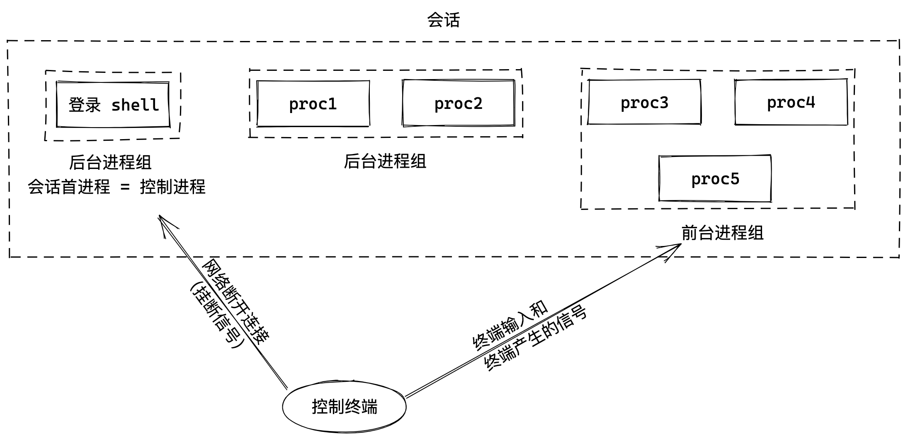
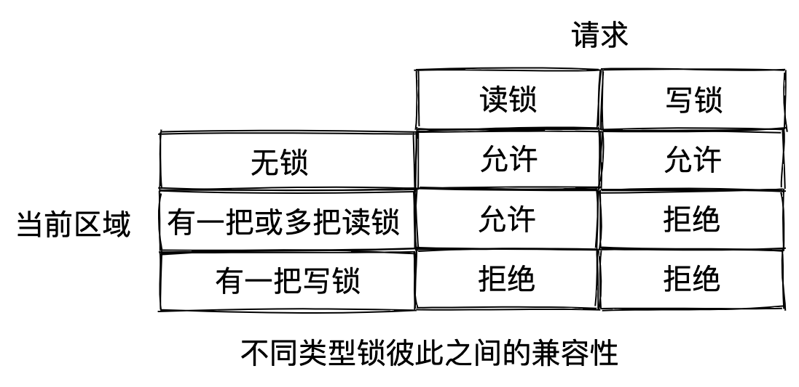

## 什么是 Daemon？

守护进程（daemon）是生存期长的一种进程。它们常常在系统引导装入时启动，仅在系统关闭时才终止。因为它们没有控制终端，所以说它们是在后台运行的。Unix 中有很多守护进程，它们执行系统任务。

## 什么时候需要写一个 Daemon

日常工作中，我们经常需要写一个脚本来处理一些事情，例如：

- 消息推送；
- 与商户系统进行对账；
- 数据迁移；
- 商户后台系统健康度监测；
- 其他的一些处理任务，etc……

其实说是 Daemon，但这里更多的案例是定时任务，使用 `crontab` 定时拉起 Daemon 进行任务处理。

一般我们就是撸起袖子开干：

1. 使用 Cpp 写一个 main，对文件中的每一行进行处理
2. 编写 Shell 脚本
   1. SED 分割文件
   2. for 循环 main 二进制，拉起的进程数等于分割的文件数
   3. AWK 处理输出日志，进行后续处理

第 2 步中的 Shell 文件，使用 `nohup ./xxx.sh &` 进行执行

- `&` 通过一个子进程（作为当前 Shell 的子进程）在后台运行 `./xxx.sh`，「后台任务 background job」
  - 终端执行了一次 `fork`，让待执行的命令作为子进程运行，不阻塞终端窗口输入；此后台任务没有获得控制终端，不能接收输入（但是可以往终端输出信息）
- `nohup` 设置忽略 `SIGHUP` 信号

`nohup` 和 `&` 一起作用，让命令在后台执行。我们要问，这样运行起来的是 Daemon 守护进程吗？一起来看看 Daemon 的特征吧。

## Daemon 的特征

我们先看一下常用的系统守护进程：`ps -axj`，`-a` 显示由其他用户所拥有的进程的状态，`-x` 显示没有控制终端的进程状态，`-j` 显示与作业有关的信息：会话 ID、进程组 ID、控制终端以及终端进程组 ID。

```bash
 $ ps -axj
 PPID   PID  PGID   SID   TTY   UID   TIME   COMMAND
    0     1     1     1   ?       0  40:01   /usr/lib/systemd/systemd --switched-root --system --deserialize 22
    0     2     0     0   ?       0   0:02   [kthreadd]
    2     3     0     0   ?       0   0:10   [ksoftirqd/0]
    2     5     0     0   ?       0   0:00   [kworker/0:0H]
    2     7     0     0   ?       0   0:31   [migration/0]
    2     8     0     0   ?       0   0:00   [rcu_bh]
    2     9     0     0   ?       0 121:34   [rcu_sched]
    2    48     0     0   ?       0   0:00   [netns]
    2    52     0     0   ?       0   0:00   [bioset]
    2    53     0     0   ?       0   0:00   [crypto]
    2    75     0     0   ?       0   0:00   [cciss_scan]
    2    76     0     0   ?       0   0:00   [nvme]
    2    97     0     0   ?       0   0:00   [ipv6_addrconf]
    2   155     0     0   ?       0   0:00   [kauditd]
```

按照顺序，各列标题分别对应为：父进程 ID、进程 ID、进程组 ID、会话 ID、终端名称、用户 ID、命令字符串。

父进程 ID 为 0 的各进程通常是内核进程，它们作为系统引导装入过程的一部分而启动（`init` 是个例外，它是一个由内核在引导装入时启动的用户层次的命令）。内核进程是特殊的，通常存在于系统的整个生命周期中。它们以 root 特权运行，无控制终端，无命令行。

进程 1 通常是 `init`（目前打印出来的是 `systemd`[^1]），它是一个系统守护进程，除了其他工作外，主要负责启动各运行层次特定的系统服务。这些服务通常是在它们自己拥有的守护进程的帮助下实现的。

注意，大多数守护进程都是以 root 特权运行。所有的守护进程都没有控制终端，其终端名设置为问号。内核守护进程以无控制终端方式启动。用户层守护进程缺少控制终端可能是守护进程调用了 `setsid` 的结果。大多数用户层守护进程都是进程组的组长进程以及会话的首进程，而且是这些进程组和会话中的唯一进程（`rsyslogd` 是一个例外）。最后，所有的用户层守护进程的父进程都是 `init` 进程。

## 会话、进程组、控制终端

每个进程除了有一个进程 ID 外，还属于一个进程组。进程组是一个或多个进程的集合。进程组之于进程，类似于文件夹基于文件，主要是为了方便管理，同一个进程组中的各进程接受来自同一个终端的各种信号。

每个进程组有一个唯一的进程组 ID。

每个进程组有一个组长进程（leader process）。组长进程的进程组 ID 等于其进程 ID。

-> 一个进程组的进程组 ID == 该进程组组长进程的进程 ID

会话（session）是一个或多个进程组的集合，被分为一个前台进程组（foreground process group）以及一个或多个后台进程组（background process group）。

一个会话可以有一个控制终端（controlling terminal），通常是终端设备（在终端登录情况下）或伪终端设备（在网络登录情况下）。和控制终端建立连接的会话首进程被称为控制进程（controlling process）。通常，我们不必担心控制状态，登录时，将自动建立控制终端。

进程组、会话和控制终端的关系，如下图所示。



图 1 - 进程组、会话和控制终端的关系

## nohup & 运行起来的是 Daemon 吗？

现在，我们可以回答这个问题了，`nohup ./xxx.sh &` 运行起来的后台作业（background job）与 Daemon，二者还是有区别的，虽然后台作业可以在一定程度上不受控制终端约束，可达到控制终端退出后自己仍然运行的目的，但是还有几个问题：

1. 关闭终端后会发送 `SIGHUP` 信号给回话首进程（session leader），回话首进程在收到后会进行信号处理，其处理方式依赖于系统实现和系统配置，可能导致后台作业同步退出。
2. 控制终端退出了，但后台作业还是可以往终端输出信息；而守护进程是无控制终端的。
3. Unix/Linux 的进程会继承多父进程的很多特性，例如文件掩码（mask）、当前工作目录、已打开的文件句柄、信号处理特征等，可能导致进程本身和环境依赖相关，应该重置。

那写 Daemon 的正确姿势是什么样的呢？

## Daemon 编程最佳实践

在大多数 Unix 系统中，守护进程是一直存在的。为了初始化我们自己的进程，使之作为守护进程运行，需要一些审慎的思索。在编写守护进程时需遵循一些基本规则，以防止产生不必要的交互作用。

1、调用 `umask`[^2] 将文件模式创建屏蔽字设置为一个已知值（通常是 0）。子进程继承得来的父进程的文件模式创建屏蔽字，可能会被设置为拒绝某些权限。因此，将文件模式创建屏蔽字设置为 0，可以大大增强子进程的灵活性。


图 2 - umask(0)

2、调用 `fork`，然后父进程 `exit`。父进程终止会让 Shell 认为这个命令已经执行完毕，同时虽然子进程继承了父进程的进程组 ID，但其进程 ID 是新分配的，二者不可能相等，这就保证了子进程不是一个进程组的组长进程（为接下来第 3 步调用 `setsid` 做好准备）。

在调用了 `fork` 函数后，子进程全盘拷贝了父进程的会话、进程组、控制终端等，虽然父进程退出了，但会话、进程组、控制终端等并没有改变，因此，这还不是真正意义上的独立开来。接下来，

3、调用 `setsid`[^3] 创建一个新会话。针对会话、进程组、控制终端执行三个步骤：

- （i）摆脱原会话的控制：该进程成为新会话的首进程（session leader，会话首进程是创建该会话的进程），此时，该进程是新会话中的唯一进程；

- （ii）摆脱原进程组的控制：该进程成为一个新进程组的组长进程。新建成进程组 ID 是该调用进程的进程 ID；
- （iii）摆脱控制终端：该进程没有控制终端。如果在调用 `setsid` 之前该进程有一个控制终端，那么与该终端的联系被解除。

4、再次调用 `fork`，`exit` 终止父进程，继续使用子进程中的守护进程。这样就保证了该守护进程不会是会话首进程，可以防止它取得控制终端（因为作为无控制终端的进程组的组长进程，它可以重新申请打开一个控制终端）。

5、将当前工作目录更改为根目录 `chdir("/")`。从父进程继承过来的当前目录可能在一个挂载的文件系统中，以防该文件系统在守护进程的执行期间不能被卸载。

6、关闭不再需要的文件描述符，使得守护进程不再持有从其父进程继承而来的任何文件描述符。

7、注册信号处理函数[^4]。

8、执行处理任务。

[The Linux Programming Interface](https://www.man7.org/tlpi/) 提供了一个创建 Daemon 守护进程的代码片段 [become_daemon.c[^5]](https://www.man7.org/tlpi/code/online/dist/daemons/become_daemon.c.html)，当然 Unix 环境高级编程第 13 章也给到了详细的[代码示例[^6]](http://www.apuebook.com/src.3e.tar.gz)，可以下载后进入 `daemons` 目录查看。


图 3 - Daemon 编程最佳实践

## 单实例 Daemon

为了正常运行，某些守护进程会实现为，在任一时刻只运行该守护进程的一个副本。例如，对 `cron` 守护进程而言，如果同时有多个实例运行，那么每个副本都可能试图开始某个预定的操作，于是造成该操作的重复执行，这很可能导致错误。

文件和记录锁机制可以保证一个守护进程只有一个副本在运行。如果每一个守护进程创建一个有固定名字的文件，并在该文件的整体上加一把锁，那么只允许创建一把这样的写锁。在此之后创建写锁的所有尝试都会失败，这向后续守护进程的副本指明已有一个副本正在运行。

文件和记录锁[^7]提供了一种方便的互斥机制。如果守护进程在一个文件的整体上得到一把写锁，那么在该守护进程终止时，这把锁将被自动删除。

[The Linux Programming Interface](https://www.man7.org/tlpi/) 提供了一个创建 PID 文件代码片段 [create_pid_file.c[^8]](https://www.man7.org/tlpi/code/online/dist/filelock/create_pid_file.c.html)

```c
/*
struct flock {
    off_t       l_start;    // starting offset
    off_t       l_len;      // len = 0 means until end of file
    pid_t       l_pid;      // lock owner
    short       l_type;     // lock type: read/write, etc.
    short       l_whence;   // type of l_start
};
*/

/* Lock a file region using nonblocking F_SETLK */
int lockFile(int fd, int type, int whence, int start, int len) {
  struct flock fl;

  fl.l_type = type;
  fl.l_whence = whence;
  fl.l_start = start;
  fl.l_len = len;

  return fcntl(fd, F_SETLK, &fl);
}

#define BUF_SIZE 100 /* Large enough to hold maximum PID as string */

int createPidFile(const char* progName, const char* pidFile, int flags) {
  int fd;
  char buf[BUF_SIZE];

  fd = open(pidFile, O_RDWR | O_CREAT, 0666);
  if (fd == -1) {
    errExit("Could not open PID file %s", pidFile);
  }

  if (flags & CPF_CLOEXEC) {
    /* Set the close-on-exec file descriptor flag */
    flags = fcntl(fd, F_GETFD); /* Fetch flags */
    if (flags == -1) {
      errExit("Could not get flags for PID file %s", pidFile);
    }

    flags |= FD_CLOEXEC; /* Turn on FD_CLOEXEC */

    if (fcntl(fd, F_SETFD, flags) == -1) {
      /* Update flags */
      errExit("Could not set flags for PID file %s", pidFile);
    }
  }

  if (lockFile(fd, F_WRLCK, SEEK_SET, 0, 0) == -1) {
    if (errno == EAGAIN || errno == EACCES) {
      fatal("PID file '%s' is locked; probably '%s' is already running", pidFile, progName);
    } else {
      errExit("Unable to lock PID file '%s'", pidFile);
    }
  }

  if (ftruncate(fd, 0) == -1) {
    errExit("Could not truncate PID file '%s'", pidFile);
  }

  snprintf(buf, BUF_SIZE, "%ld\n", (long)getpid());
  if (write(fd, buf, strlen(buf)) != strlen(buf)) {
    fatal("Writing to PID file '%s'", pidFile);
  }

  return fd;
}
```

1、`open(pidfile, O_RDWR | O_CREAT)` 打开或新建一个文件，返回对应的文件描述符 fd。

2、`flags |= FD_CLOEXEC` 对所有被执行程序不需要的文件描述符设置执行时关闭（`close-on-exec`）标识；

3、`fcntl(fd, F_SETLK, &fl)` 对 pidFile 文件加锁（排它锁）

- `l_len = 0` 表示锁的范围可以扩展到最大可能偏移量。这意味着不管向该文件中追加写了多少数据，他们都可以处于锁的范围内，而且起始位置可以是文件中的任意一个位置
- 为了对整个文件进行加锁，设置 `l_start` 和 `l_whence` 指向文件的起始位置，并且指定长度（`l_len`）为 0
- `l_type` 可以表示三种类型：`F_RDLCK`（共享性读锁）、`F_WRLCK`（独占性写锁）或 `F_UNLCK`（解锁一个区域）
- 两种类型的锁：共享性读锁（`F_RDLCK`）和独占性写锁（`F_WRLCK`），基本规则是：任意多个进程在一个给定的字节上可以有一把共享的读锁，但是在一个给定的字节上只能有一个进程有一把独占锁。进一步解释，如果在一个给定字节上已经有一把或多把读锁，则不能在该字节上再加写锁；如果在一个字节上已经有一把独占性写锁，则不能在对它加任何读锁。下图表示了这些兼容性规则：



图 4 - 不同类型锁彼此之间的兼容性


- `F_SETLK` 如果我们试图获取一把读锁或写锁，而上述的兼容性规则阻止系统给我们这把锁，那么 `fcntl` 会立即出错返回，此时 `errno` 设置为 `EACCES` 或 `EAGAIN`

4、`ftruncate(fd, 0)` 将文件长度截断为 0。其原因是之前的守护进程实例的进程 ID 字符串可能长于调用此函数的当前进程 ID 字符串。例如，之前的守护进程的进程 ID 是 12345，当前实例的进程 ID 是 9999，那么将此进程 ID 写入文件后，在文件中留下的是 99995。将文件长度截断为 0 就解决了此问题。

5、`write(fd, strPid, strlen(strPid)` 将进程 pid 写入文件。后续当有实例启动执行时，会试图调用 `fcnt(fd, F_SETLK, &fl)` 对 pidFile 进行加锁，会执行失败（由于已经有一个进程持有了排它锁），表示已有副本正在运行。

## 总结

至此，我们从 Daemon 的特征入手，讨论了其与 `nohup + &` 启动后台作业的区别，进而介绍构建 Daemon 的最佳实践，以及如何保证 Daemon 的单实例执行。读者可以从本文中给到的 Demo 入手，运行起来。

## 画图工具

文中的图片使用 [excalidraw](https://excalidraw.com/) 绘制

## 版权声明

本作品采用[知识共享署名 4.0 国际许可协议](http://creativecommons.org/licenses/by/4.0/)进行许可，转载时请注明原文链接。

[^1]: LINUX PID 1 和 SYSTEMD https://coolshell.cn/articles/17998.html

[^2]: umask https://man7.org/linux/man-pages/man2/umask.2.html

[^3]: setsid https://man7.org/linux/man-pages/man2/setsid.2.html

[^4]: Unix 环境高级编程 第 10 章 - 信号

[^5]: [Linux/UNIX系统编程手册](https://book.douban.com/subject/25809330/) https://www.man7.org/tlpi/code/online/dist/daemons/become_daemon.c.html

[^6]: APUE Source Code http://www.apuebook.com/code3e.html

[^7]: Unix 环境高级编程 第 14 章 - 高级I/O - 14.3 记录锁

[^8]: Linux/UNIX系统编程手册 https://www.man7.org/tlpi/code/online/dist/filelock/create_pid_file.c.html
